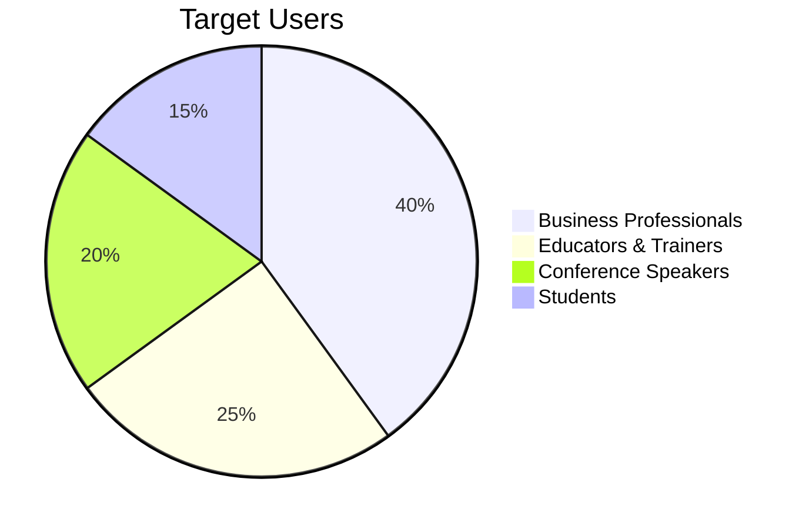

# Clicker

**Turn your iPhone into a professional presentation remote.**

## Value Proposition

Clicker solves a universal presenter pain point: **dedicated presentation remotes are expensive, easy to forget, and another device to charge**. Every presenter already has an iPhone in their pocket.

### Core Problem
- Physical clickers cost $30-100+
- Easy to forget or lose
- Batteries die at critical moments
- No timer feedback during presentations
- Generic design with unnecessary buttons

### Clicker's Solution
- **Zero hardware** — use the phone you already carry
- **Works everywhere** — no Bluetooth pairing hassles, just WiFi
- **Built for stage visibility** — dark mode, large buttons, haptic timing cues
- **Professional timer** — know when you're running over without checking your watch

## Target Market

### Primary Users
1. **Business professionals** presenting in meetings, sales pitches, board rooms
2. **Educators & trainers** running workshops and lectures
3. **Conference speakers** on stage without wanting another gadget
4. **Students** presenting thesis defenses or class projects

### Market Size
- 35M+ presentations happen every day globally (Source: Duarte)
- Presentation remote market: ~$500M annually
- iPhone users who regularly present: tens of millions

## Competitive Landscape

| Competitor | Price | Weaknesses |
|------------|-------|------------|
| Logitech Spotlight | $129 | Expensive, bulky, batteries |
| Kensington Presenter | $50 | Basic, no timer, forgettable |
| Keynote Remote (Apple) | Free | Keynote only, basic UI |
| Clicker | $19.99/yr | Works with all software, superior UX |

### Differentiation
1. **Universal compatibility** — Works with PowerPoint, Keynote, Google Slides, Prezi, anything
2. **Timer with haptic feedback** — Get silent vibration cues at intervals (unique feature)
3. **Premium UX** — Designed for stage, not just functionality
4. **Subscription model** — Sustainable business vs. one-time purchase

## Current Features (v1.0)

### iPhone Remote
- Large next/previous buttons optimized for one-hand operation
- Golden ratio sizing (Next button larger — it's used 90% of the time)
- Dark mode for stage visibility
- Start/end presentation controls
- Black screen toggle

### Presentation Timer
- Configurable duration (5/10/15/20/30 min presets)
- Visual progress bar with color warnings (green → yellow → orange → red)
- Haptic feedback at configurable intervals
- Overtime alerts

### Connectivity
- Automatic discovery of Mac on local network
- Instant reconnection if WiFi drops
- Works on personal hotspot (airport/hotel scenarios)

## Business Model

### Pricing
- **Free trial**: 7 days (full functionality)
- **Annual subscription**: $19.99/year
- **No monthly option** — encourages annual commitment

### Revenue Projections (Conservative)

| Scenario | Annual Downloads | Conversion | ARPU | ARR |
|----------|-----------------|------------|------|-----|
| Base | 10,000 | 5% | $20 | $10,000 |
| Growth | 50,000 | 8% | $20 | $80,000 |
| Scale | 200,000 | 10% | $20 | $400,000 |

## Product Roadmap

### Phase 1: Foundation (Current)
✅ Core remote functionality
✅ Presentation timer with haptics
✅ Subscription monetization
✅ Mac menu bar app

### Phase 2: Polish & Expand
- [ ] **Apple Watch app** — glance at timer, tap to advance
- [ ] **iPad app** — presenter view with notes display
- [ ] **Slide preview** — see current/next slide on iPhone
- [ ] **Presenter notes** — display notes synced from presentation
- [ ] **Custom gestures** — swipe patterns for different actions

### Phase 3: Enterprise & Teams
- [ ] **Multi-presenter mode** — hand off control seamlessly
- [ ] **Laser pointer simulation** — show pointer on slides
- [ ] **Recording integration** — timestamp key moments
- [ ] **Analytics** — presentation pace, timing patterns
- [ ] **Team licenses** — volume pricing for organizations

### Phase 4: Platform Expansion
- [ ] **Windows companion app** — expand beyond Mac
- [ ] **Web companion** — browser extension for Google Slides
- [ ] **Android remote** — capture non-iPhone users

## Success Metrics (KPIs)

### Acquisition
- App Store downloads per week
- Download → Trial start rate (target: 95%)
- Organic vs. paid acquisition ratio

### Activation
- Trial → Connected to Mac rate (target: 80%)
- First presentation completion rate
- Timer feature adoption rate

### Retention
- Trial → Subscription conversion (target: 8-12%)
- Annual renewal rate (target: 70%)
- NPS score (target: 50+)

### Revenue
- Monthly Recurring Revenue (MRR)
- Annual Recurring Revenue (ARR)
- Customer Acquisition Cost (CAC)
- Lifetime Value (LTV)

## Strategic Considerations

### Why Subscription vs. One-Time Purchase
1. **Sustainable development** — fund continuous improvements
2. **Alignment of incentives** — we must keep delivering value
3. **Lower barrier to entry** — $20/year vs. $50 upfront
4. **Predictable revenue** — better for planning

### Why Mac-Only Initially
1. **Apple ecosystem synergy** — iPhone + Mac users are our sweet spot
2. **Quality focus** — ship excellent on one platform before expanding
3. **StoreKit simplicity** — unified subscription across devices

### Risks & Mitigations

| Risk | Impact | Mitigation |
|------|--------|------------|
| Apple builds this feature | High | Move faster, build unique features (haptic timer, Apple Watch) |
| Low conversion rate | Medium | A/B test pricing, add value to paid tier |
| Network reliability issues | Medium | Robust reconnection, keepalive system (already implemented) |
| Mac App Store restrictions | Low | Distribute outside App Store if needed |

## Brand & Positioning

### Tagline Options
- "Your iPhone. Your Remote."
- "Present like a pro."
- "The clicker you always have."

### Design Philosophy
- **Apple liquid glass aesthetic** — fits native iOS/macOS look
- **Dark mode only** — practical for stage use, premium feel
- **Minimal UI** — two buttons, one timer, that's it

## Technical Reference

For implementation details, build commands, and architecture, see [CLAUDE.md](https://github.com/douinc/clicker/blob/main/CLAUDE.md).

---

*Last updated: January 2026*
