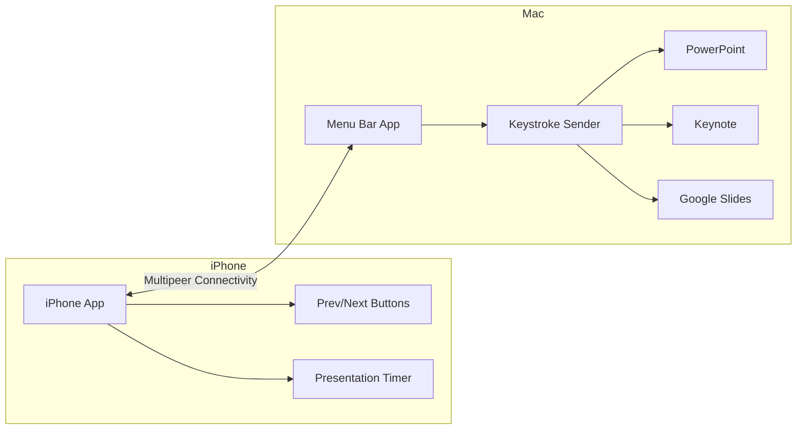

# Presentation Remote

A simple iPhone app to control presentations on your Mac. Works with PowerPoint, Keynote, Google Slides, and any other presentation software.

## Features

- Next/Previous slide control
- Haptic feedback on button press
- Auto-discovery of Mac on local network
- Menu bar app for Mac (stays out of the way)
- Secure peer-to-peer connection
- **Presentation Timer** with configurable vibration intervals
- Multiple vibration patterns (interval, halfway, time's up, overtime)

## Architecture



## Project Structure

```
presentation-remote/
├── project.yml                 # XcodeGen configuration
├── Shared/
│   └── RemoteCommand.swift     # Shared command protocol
├── MacApp/
│   ├── PresentationRemoteMacApp.swift
│   ├── MacConnectionManager.swift
│   ├── KeystrokeSender.swift
│   ├── Info.plist
│   └── PresentationRemoteMac.entitlements
├── iPhoneApp/
│   ├── PresentationRemoteiPhoneApp.swift
│   ├── iPhoneConnectionManager.swift
│   ├── PresentationTimer.swift
│   └── Info.plist
└── README.md
```

## Prerequisites

- macOS 13.0+
- iOS 17.0+
- Xcode 15+
- [XcodeGen](https://github.com/yonaskolb/XcodeGen)

```bash
brew install xcodegen
```

## Build & Run (CLI)

### 1. Generate Xcode Project

```bash
xcodegen generate
```

This creates `PresentationRemote.xcodeproj` from `project.yml`.

### 2. Build Mac App

```bash
xcodebuild -scheme PresentationRemoteMac build
```

### 3. Run Mac App

```bash
open ~/Library/Developer/Xcode/DerivedData/PresentationRemote-*/Build/Products/Debug/Presentation\ Remote.app
```

### 4. Build iPhone App

For simulator:
```bash
xcodebuild -scheme PresentationRemoteiOS \
  -destination 'platform=iOS Simulator,name=iPhone 16,OS=18.2' build
```

For physical device (replace `DEVICE_ID` with your device):
```bash
# Find your device ID
xcrun devicectl list devices

# Build for device
xcodebuild -scheme PresentationRemoteiOS \
  -destination 'id=YOUR_DEVICE_ID' build
```

### 5. Install & Run on iPhone

```bash
# Install
xcrun devicectl device install app \
  --device YOUR_DEVICE_ID \
  ~/Library/Developer/Xcode/DerivedData/PresentationRemote-*/Build/Products/Debug-iphoneos/PPT\ Remote.app

# Launch
xcrun devicectl device process launch \
  --device YOUR_DEVICE_ID \
  com.dou.presentation-remote-ios
```

### Quick Commands

```bash
# Build both apps
xcodebuild -scheme PresentationRemoteMac build &
xcodebuild -scheme PresentationRemoteiOS -destination 'generic/platform=iOS Simulator' build &
wait

# Clean build
xcodebuild -scheme PresentationRemoteiOS clean build

# List available simulators
xcrun simctl list devices available

# List connected devices
xcrun devicectl list devices
```

## Configuration

### Changing Team ID

Edit `project.yml` and update the `DEVELOPMENT_TEAM` value:

```yaml
settings:
  base:
    DEVELOPMENT_TEAM: YOUR_TEAM_ID
```

Then regenerate: `xcodegen generate`

### Finding Your Team ID

```bash
security find-identity -v -p codesigning | grep "Apple Development"
# Team ID is the 10-character code in parentheses
```

## First Run Setup

### Mac App
1. Run the Mac app - it appears in your menu bar (not Dock)
2. Grant **Accessibility permission** when prompted:
   - System Settings → Privacy & Security → Accessibility
   - Enable "Presentation Remote"
3. Click menu bar icon → **Start Listening**

### iPhone App
1. Run the iPhone app
2. Tap **Search for Mac**
3. Grant **Local Network permission** when prompted
4. Select your Mac from the list
5. Use **◀ Prev** and **Next ▶** buttons to control slides

## Timer Feature

The presentation timer provides tactile feedback so you can track time without looking at your phone.

### Vibration Patterns

| Pattern | Trigger | Feel |
|---------|---------|------|
| **Interval** | Every X minutes (configurable) | Single pulse |
| **Halfway** | 50% of presentation time | Triple pulse |
| **Time's Up** | End of set duration | Long continuous vibration |
| **Overtime** | Every 30 seconds after time's up | Double pulse |

### Configuration Options

- **Vibration Intervals:** 30 sec, 1 min, 2 min, 5 min, 10 min
- **Presentation Duration:** No limit, 5, 10, 15, 20, 30 minutes

## Troubleshooting

### Connection Issues
- Ensure both devices are on the same Wi-Fi network
- Check that no firewall is blocking the connection
- Try disabling VPN if active

### Keystrokes Not Working
- Verify Accessibility permission is granted
- Check the Mac app's menu bar for green "Connected" status

### App Not Finding Mac
- Make sure Mac app shows "Waiting for iPhone to connect..."
- Ensure Local Network permission is granted on iPhone

### Build Errors

**"Signing requires a development team"**
```bash
# Add your Team ID to project.yml, then:
xcodegen generate
```

**"Unable to find destination"**
```bash
# List available destinations
xcodebuild -scheme PresentationRemoteiOS -showdestinations
```

## Extending the App

### Adding More Commands

1. Add new case to `RemoteCommand` enum in `Shared/RemoteCommand.swift`:
```swift
case blackScreen = "black"

var keyCode: UInt16 {
    switch self {
    case .blackScreen: return 11  // 'B' key
    // ...
    }
}
```

2. Add button to iPhone UI in `iPhoneApp/PresentationRemoteiPhoneApp.swift`:
```swift
Button("Black Screen") {
    connectionManager.sendCommand(.blackScreen)
}
```

## Key Codes Reference

| Key | Code | Use |
|-----|------|-----|
| Left Arrow | 123 | Previous slide |
| Right Arrow | 124 | Next slide |
| Return | 36 | Start presentation |
| Escape | 53 | End presentation |
| Space | 49 | Next slide (alternative) |
| B | 11 | Black screen (PowerPoint) |
| W | 13 | White screen (PowerPoint) |

## License

MIT License - Feel free to use and modify!
