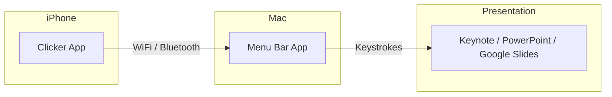
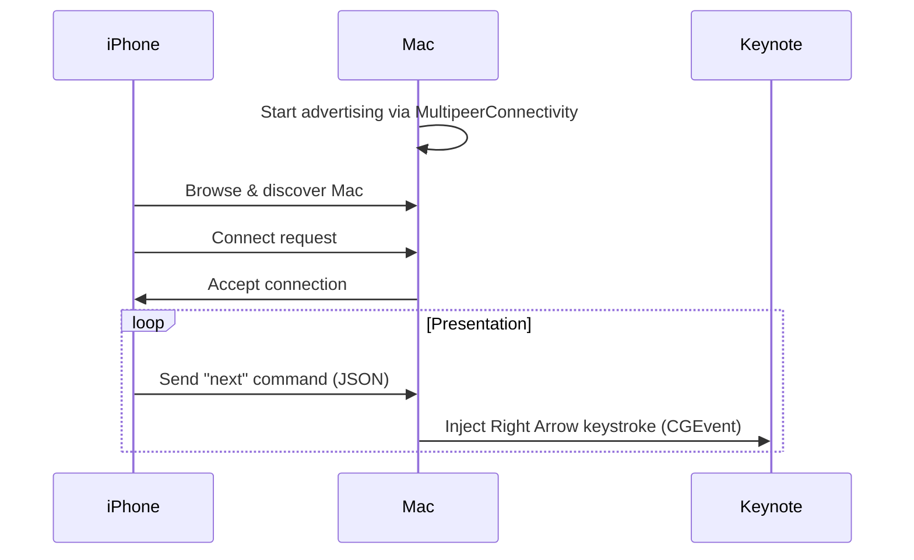

# Clicker

> Control your presentations from your iPhone — no dongles, no internet required.


Clicker is a presentation remote that turns your iPhone into a wireless clicker for your Mac. It uses peer-to-peer networking — no cloud servers, no account required, works offline.



## Features

- **Wireless Control** — Navigate slides with large, easy-to-hit touch targets
- **Peer-to-Peer** — Direct connection via MultipeerConnectivity (WiFi or Bluetooth)
- **Presentation Timer** — Track time with configurable haptic alerts
- **Works Offline** — No internet connection needed
- **Dark Mode** — Stage-friendly interface with liquid glass aesthetic
- **Universal Compatibility** — Works with any app that uses arrow keys (Keynote, PowerPoint, Google Slides, Figma, etc.)

## Installation

### Mac App (Free & Open Source)

**Option 1: Download Release**

Download the latest `.dmg` from [Releases](https://github.com/douinc/clicker/releases), drag `Clicker.app` to Applications, and grant Accessibility permission when prompted.

**Option 2: Build from Source**

```bash
# Install XcodeGen if you haven't
brew install xcodegen

# Clone and build
git clone https://github.com/douinc/clicker.git
cd clicker
xcodegen generate
xcodebuild -scheme ClickerMac -configuration Release build

# Run the app
open ~/Library/Developer/Xcode/DerivedData/Clicker-*/Build/Products/Release/Clicker.app
```

### iPhone App

Download from the [App Store](https://apps.apple.com/app/clicker) *(coming soon)*

- 7-day free trial included
- $4.99/year subscription

## Usage

1. **Launch the Mac app** — Look for the Clicker icon in your menu bar
2. **Grant Accessibility permission** — Required to send keystrokes to presentation apps
3. **Open the iPhone app** — It will automatically discover your Mac
4. **Tap to connect** — Select your Mac from the list
5. **Present!** — Use the large buttons to navigate slides

### Presentation Timer

The built-in timer helps you stay on track during presentations:

| Feature | Description |
|---------|-------------|
| **Duration Presets** | 5, 10, 15, 20, 30 minutes or unlimited |
| **Haptic Intervals** | Vibrate every 30s, 1m, 2m, or 5m |
| **Visual Progress** | Color-coded bar (green → yellow → orange → red) |
| **Overtime Alert** | Timer turns red when you exceed your time |

## Architecture



## Project Structure

```
clicker/
├── project.yml          # XcodeGen configuration
├── Shared/              # Shared code (RemoteCommand protocol)
├── MacApp/              # macOS menu bar application
│   ├── PresentationRemoteMacApp.swift
│   ├── MacConnectionManager.swift
│   └── KeystrokeSender.swift
└── iPhoneApp/           # iOS remote control app
    ├── PresentationRemoteiPhoneApp.swift
    ├── iPhoneConnectionManager.swift
    ├── PresentationTimer.swift
    ├── SubscriptionManager.swift
    └── PaywallView.swift
```

## Building from Source

### Prerequisites

- macOS 14.0+ (Sonoma)
- Xcode 16.0+
- [XcodeGen](https://github.com/yonaskolb/XcodeGen) (`brew install xcodegen`)
- Apple Developer account (for code signing)

### Build Commands

```bash
# Generate Xcode project
xcodegen generate

# Build Mac app
xcodebuild -scheme ClickerMac build

# Build iOS app (simulator)
xcodebuild -scheme ClickeriOS -destination 'generic/platform=iOS Simulator' build

# Build iOS app (device)
xcodebuild -scheme ClickeriOS -destination 'id=YOUR_DEVICE_ID' build
```

### Configuration

To use your own signing identity, edit `project.yml`:

```yaml
settings:
  base:
    DEVELOPMENT_TEAM: YOUR_TEAM_ID
```

Then regenerate: `xcodegen generate`

## Extending the App

### Adding Custom Commands

1. Add a new case to `RemoteCommand` in `Shared/RemoteCommand.swift`:

```swift
case blackScreen = "black"

var keyCode: UInt16 {
    switch self {
    case .blackScreen: return 11  // 'B' key
    // ...
    }
}
```

2. Add a button in the iPhone UI to trigger it.

### Common Key Codes

| Key | Code | Use |
|-----|------|-----|
| Left Arrow | 123 | Previous slide |
| Right Arrow | 124 | Next slide |
| Escape | 53 | End presentation |
| B | 11 | Black screen (PowerPoint) |
| W | 13 | White screen (PowerPoint) |

## Troubleshooting

| Issue | Solution |
|-------|----------|
| Mac not appearing | Ensure both devices are on the same WiFi network |
| Keystrokes not working | Grant Accessibility permission in System Settings → Privacy & Security |
| Connection drops | Check that no firewall or VPN is blocking local network traffic |

## Privacy

Clicker respects your privacy:

- **No accounts** — No sign-up required
- **No cloud** — All communication is peer-to-peer
- **No analytics** — We don't track your usage
- **No data collection** — Your presentations stay on your devices

See our full [Privacy Policy](PRIVACY_POLICY.md).

## Contributing

Contributions are welcome! Please feel free to submit a Pull Request.

1. Fork the repository
2. Create your feature branch (`git checkout -b feature/amazing-feature`)
3. Commit your changes (`git commit -m 'Add amazing feature'`)
4. Push to the branch (`git push origin feature/amazing-feature`)
5. Open a Pull Request

## License

This project is licensed under the MIT License — see the [LICENSE](LICENSE) file for details.

---

Made with ❤️ by [DOU Inc.](https://github.com/douinc)
