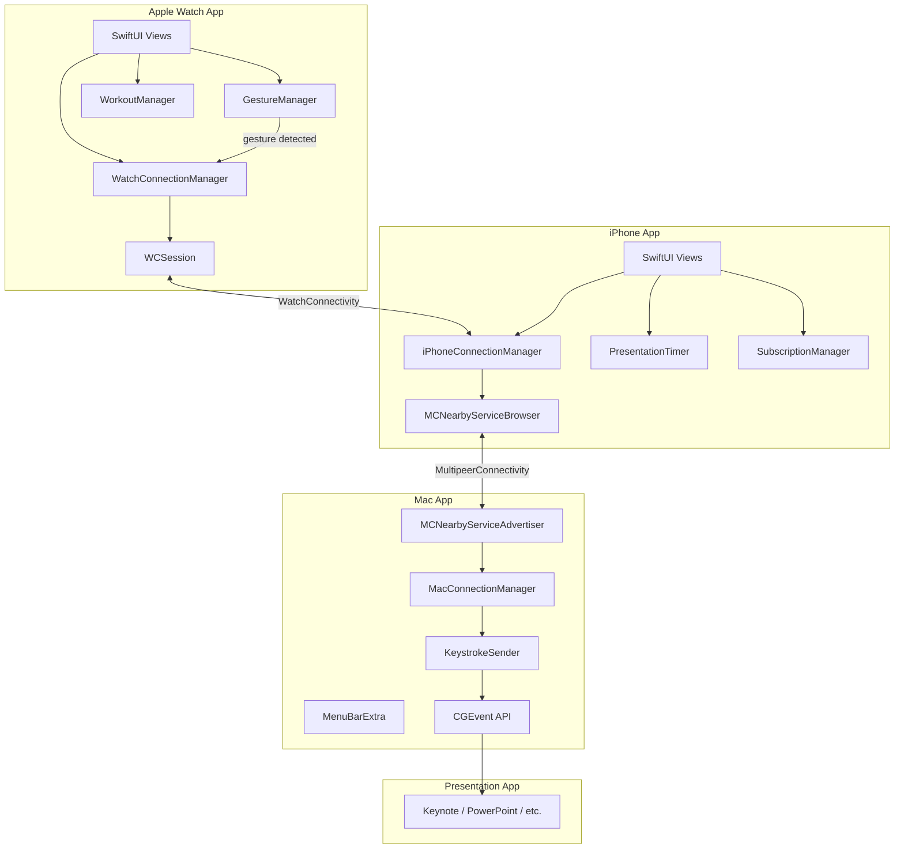
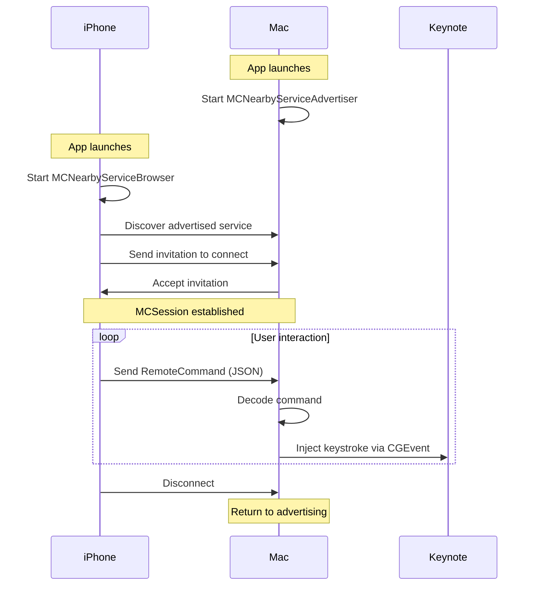
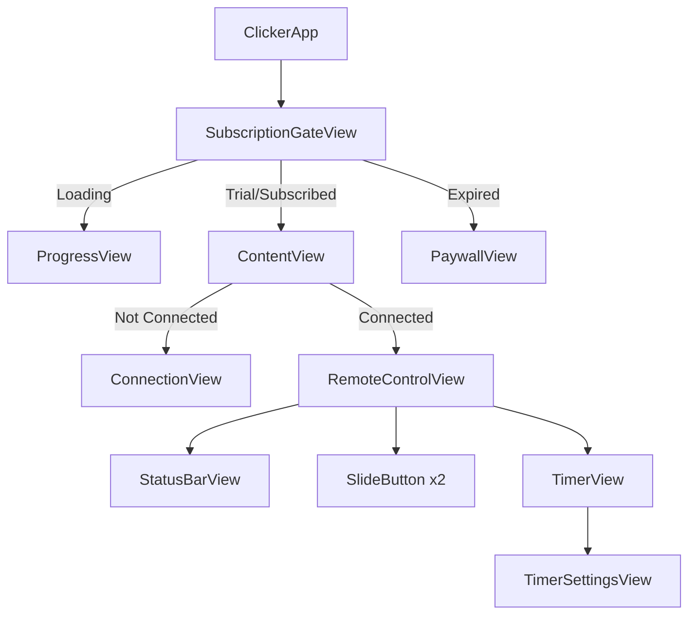
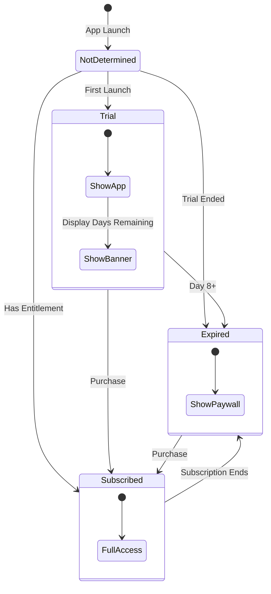

# Architecture

## System Overview

Clicker uses a client-server model over Apple's MultipeerConnectivity framework, with Apple Watch support via WatchConnectivity:

- **Mac (Server)**: Advertises presence, accepts connections, executes keystrokes
- **iPhone (Client)**: Browses for servers, initiates connections, sends commands
- **Watch (Companion)**: Sends commands to iPhone via WatchConnectivity, which relays to Mac. Supports hands-free wrist gesture control via CoreMotion



---

## Communication Protocol

### Service Discovery

Both apps use the same service type for discovery:

```swift
let serviceType = "clicker"  // Resolves to _clicker._tcp and _clicker._udp
```

The Mac advertises this service, and the iPhone browses for it.

### Message Format

Commands are sent as JSON-encoded `RemoteCommand` values:

```swift
enum RemoteCommand: String, Codable {
    case next = "next"
    case previous = "previous"
}

// Sent over the wire as:
// {"rawValue": "next"}
```

### Connection Flow



---

## Mac App Architecture

### Menu Bar Integration

The Mac app uses `MenuBarExtra` to run entirely in the menu bar:

```swift
@main
struct ClickerMacApp: App {
    var body: some Scene {
        MenuBarExtra("Clicker", systemImage: "rectangle.inset.filled.and.cursorarrow") {
            ContentView()
        }
        .menuBarExtraStyle(.window)
    }
}
```

The `LSUIElement: true` Info.plist key prevents a Dock icon.

### Keystroke Injection

`KeystrokeSender` uses the Core Graphics `CGEvent` API:

```swift
func sendKeystroke(_ keyCode: UInt16) {
    let source = CGEventSource(stateID: .hidSystemState)

    // Key down
    let keyDown = CGEvent(keyboardEventSource: source, virtualKey: keyCode, keyDown: true)
    keyDown?.post(tap: .cghidEventTap)

    // Key up
    let keyUp = CGEvent(keyboardEventSource: source, virtualKey: keyCode, keyDown: false)
    keyUp?.post(tap: .cghidEventTap)
}
```

!!! warning "Accessibility Permission"
    `CGEvent` posting requires the app to be granted Accessibility permission in System Settings.

---

## Apple Watch Architecture

The Watch app acts as a lightweight remote that relays commands through the iPhone, with support for hands-free gesture control.

### Communication Chain

```
Watch → (WCSession.sendMessage) → iPhone → (MCSession.send) → Mac
```

The Watch never connects directly to the Mac. The iPhone acts as a bridge.

### Wrist Gesture Control

The `GestureManager` uses CoreMotion to detect wrist flick gestures for hands-free slide navigation:

- **Flick forward** (wrist away from body) → Next slide
- **Flick backward** (wrist toward body) → Previous slide
- Uses gyroscope rotation rate around the x-axis (wrist flexion/extension)
- Threshold: 3.0 rad/s to filter out incidental motion
- Cooldown: 0.8 seconds between triggers to prevent double-fires
- Motion updates sampled at 50 Hz
- Double haptic pulse (directionUp/directionDown) confirms each gesture
- Toggle on/off via the hand wave button or hardware double-tap (watchOS 11+)

### Workout Session (Stay Active)

The `WorkoutManager` uses `HKWorkoutSession` to keep the Watch app visible and active during presentations. Without this, watchOS would dismiss the app when the user lowers their wrist, breaking gesture detection. The workout session auto-restarts on expiration.

!!! note "HealthKit Usage"
    Clicker does not read or store any health data. HealthKit is used solely to maintain an active workout session that prevents the system from suspending the app.

### Always-On Display

When connected to a Mac, the iPhone disables the idle timer (`UIApplication.shared.isIdleTimerDisabled = true`). This prevents the screen from locking, which would suspend the app and drop the MultipeerConnectivity session. Auto-lock resumes when you disconnect.

The Watch UI detects `isLuminanceReduced` to adjust opacity in always-on display mode.

### Watch Timer

The Watch has its own independent timer:

- **Tap** the timer to start/stop
- **Long press** the timer to reset (with `.notification` haptic feedback)
- Monospaced display with color coding (green when running, white when stopped)

---

## iPhone App Architecture

### View Hierarchy



### State Management

The app uses SwiftUI's native state management:

| State | Type | Scope |
|-------|------|-------|
| Connection | `@StateObject` + `ObservableObject` | App-wide |
| Timer | `@StateObject` + `ObservableObject` | App-wide |
| Subscription | `@State` + `@Observable` | App-wide via Environment |
| UI State | `@State` | Per-view |

### Subscription Flow



---

## Data Persistence

### Trial Tracking (Keychain)

Trial start date is stored in Keychain to survive app reinstallation:

```swift
class TrialTracker {
    private let keychainKey = "com.dou.clicker.trial.start"

    func startTrial() {
        let startDate = Date()
        // Store in Keychain with kSecAttrAccessibleAfterFirstUnlock
    }

    var daysRemaining: Int {
        // Calculate from stored start date
    }
}
```

### Subscription State (StoreKit)

Subscription status is determined from StoreKit entitlements:

```swift
func checkEntitlements() async {
    for await result in Transaction.currentEntitlements {
        // Verify and extract expiration date
    }
}
```

---

## Thread Safety

Both apps use `@MainActor` for thread-safe UI updates:

```swift
@MainActor
class MacConnectionManager: NSObject, ObservableObject {
    @Published var isConnected = false
    // All published properties update on main thread
}
```

MultipeerConnectivity delegates are dispatched to the main queue:

```swift
browser = MCNearbyServiceBrowser(peer: peerID, serviceType: serviceType)
browser.delegate = self
// Delegate methods called on main queue by default
```
