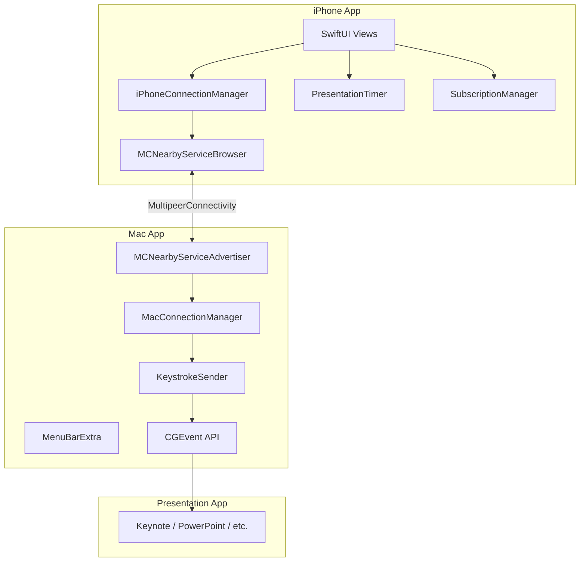
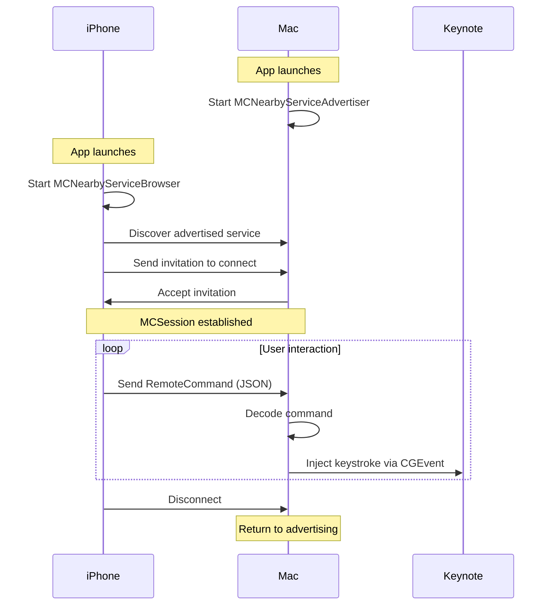
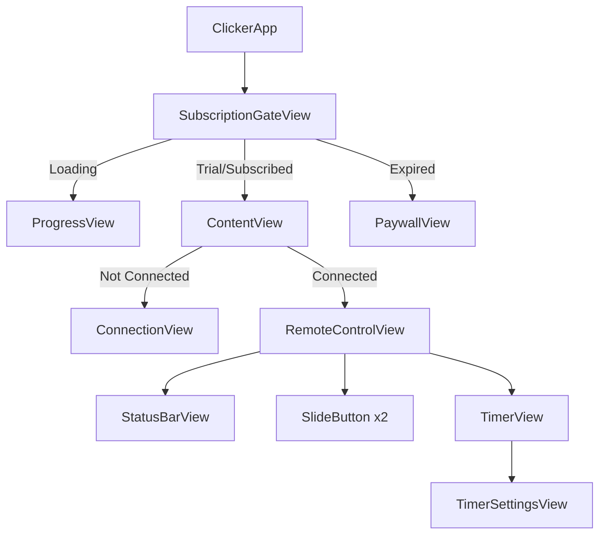
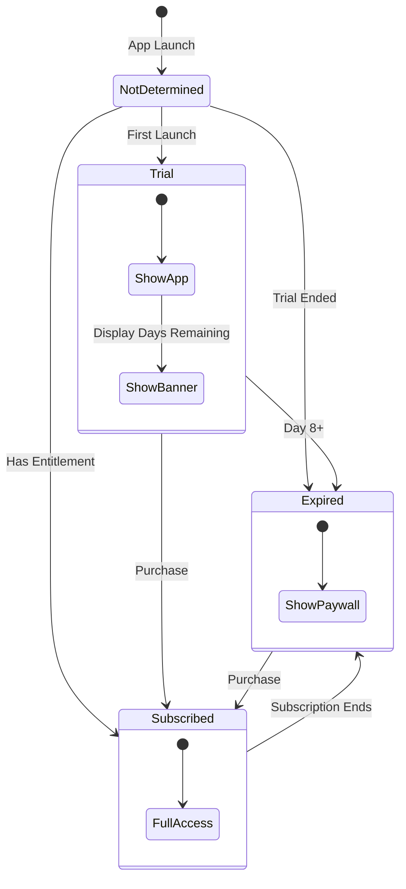

# Architecture

## System Overview

Clicker uses a client-server model over Apple's MultipeerConnectivity framework:

- **Mac (Server)**: Advertises presence, accepts connections, executes keystrokes
- **iPhone (Client)**: Browses for servers, initiates connections, sends commands



---

## Communication Protocol

### Service Discovery

Both apps use the same service type for discovery:

```swift
let serviceType = "clicker"  // Resolves to _clicker._tcp and _clicker._udp
```

The Mac advertises this service, and the iPhone browses for it.

### Message Format

Commands are sent as JSON-encoded `RemoteCommand` values:

```swift
enum RemoteCommand: String, Codable {
    case next = "next"
    case previous = "previous"
}

// Sent over the wire as:
// {"rawValue": "next"}
```

### Connection Flow



---

## Mac App Architecture

### Menu Bar Integration

The Mac app uses `MenuBarExtra` to run entirely in the menu bar:

```swift
@main
struct ClickerMacApp: App {
    var body: some Scene {
        MenuBarExtra("Clicker", systemImage: "rectangle.inset.filled.and.cursorarrow") {
            ContentView()
        }
        .menuBarExtraStyle(.window)
    }
}
```

The `LSUIElement: true` Info.plist key prevents a Dock icon.

### Keystroke Injection

`KeystrokeSender` uses the Core Graphics `CGEvent` API:

```swift
func sendKeystroke(_ keyCode: UInt16) {
    let source = CGEventSource(stateID: .hidSystemState)

    // Key down
    let keyDown = CGEvent(keyboardEventSource: source, virtualKey: keyCode, keyDown: true)
    keyDown?.post(tap: .cghidEventTap)

    // Key up
    let keyUp = CGEvent(keyboardEventSource: source, virtualKey: keyCode, keyDown: false)
    keyUp?.post(tap: .cghidEventTap)
}
```

!!! warning "Accessibility Permission"
    `CGEvent` posting requires the app to be granted Accessibility permission in System Settings.

---

## iPhone App Architecture

### View Hierarchy



### State Management

The app uses SwiftUI's native state management:

| State | Type | Scope |
|-------|------|-------|
| Connection | `@StateObject` + `ObservableObject` | App-wide |
| Timer | `@StateObject` + `ObservableObject` | App-wide |
| Subscription | `@State` + `@Observable` | App-wide via Environment |
| UI State | `@State` | Per-view |

### Subscription Flow



---

## Data Persistence

### Trial Tracking (Keychain)

Trial start date is stored in Keychain to survive app reinstallation:

```swift
class TrialTracker {
    private let keychainKey = "com.dou.clicker.trial.start"

    func startTrial() {
        let startDate = Date()
        // Store in Keychain with kSecAttrAccessibleAfterFirstUnlock
    }

    var daysRemaining: Int {
        // Calculate from stored start date
    }
}
```

### Subscription State (StoreKit)

Subscription status is determined from StoreKit entitlements:

```swift
func checkEntitlements() async {
    for await result in Transaction.currentEntitlements {
        // Verify and extract expiration date
    }
}
```

---

## Thread Safety

Both apps use `@MainActor` for thread-safe UI updates:

```swift
@MainActor
class MacConnectionManager: NSObject, ObservableObject {
    @Published var isConnected = false
    // All published properties update on main thread
}
```

MultipeerConnectivity delegates are dispatched to the main queue:

```swift
browser = MCNearbyServiceBrowser(peer: peerID, serviceType: serviceType)
browser.delegate = self
// Delegate methods called on main queue by default
```
