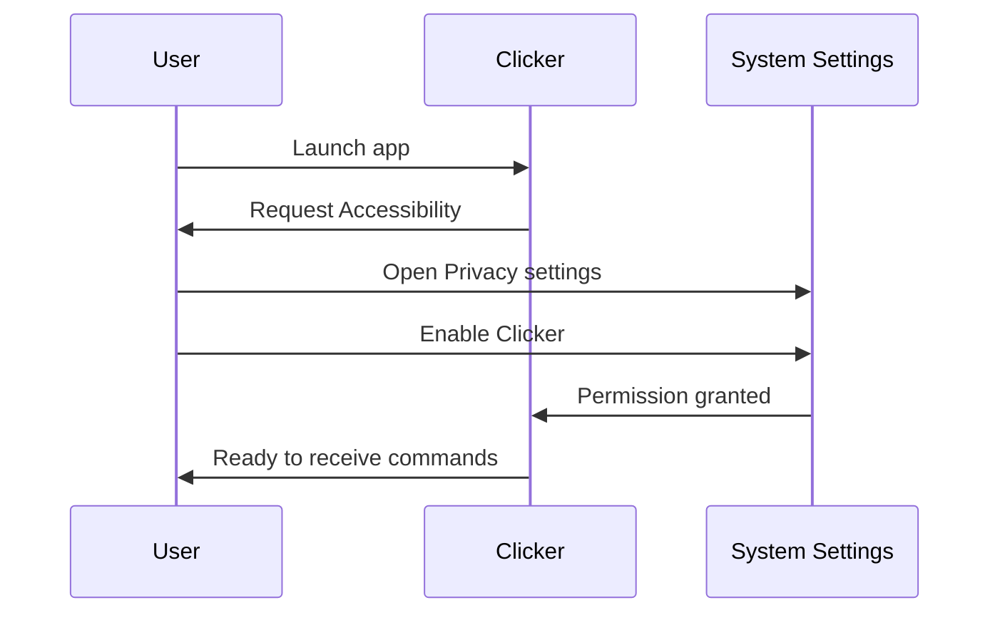

# First Run Setup

## Mac App Setup

### 1. Launch the App

The Mac app runs in your **menu bar** — look for the Clicker icon in the top-right of your screen, not the Dock.

!!! note "No Dock Icon"
    Clicker is a menu bar app (`LSUIElement: true`), so it won't appear in your Dock.

### 2. Grant Accessibility Permission

The app needs Accessibility permission to send keystrokes to presentation software.

1. Click the Clicker menu bar icon
2. macOS will prompt for Accessibility access
3. Click **Open System Settings**
4. Navigate to **Privacy & Security → Accessibility**
5. Enable **Clicker** in the list



!!! warning "Permission Required"
    Without Accessibility permission, the app cannot send keystrokes. Your presentation software won't receive any commands.

### 3. Start Listening

Once permission is granted:

1. Click the menu bar icon
2. The app will show "Waiting for iPhone to connect..."
3. Your Mac is now discoverable by the iPhone app

---

## iPhone App Setup

### 1. Launch and Trial

On first launch:

- A 7-day free trial starts automatically
- Full access to all features during trial
- Orange banner shows remaining trial days

### 2. Grant Local Network Permission

When the app searches for your Mac:

1. iOS will prompt for Local Network access
2. Tap **Allow**
3. This permission is required for device discovery

### 3. Connect to Mac

1. Ensure both devices are on the same WiFi network
2. The iPhone will discover available Macs
3. Tap your Mac's name to connect
4. Wait for "Connected" status

---

## Using the Remote

Once connected, you'll see the main remote interface:

```
┌─────────────────────────┐
│  ● Connected to Mac     │
├─────────────────────────┤
│                         │
│      ◀  Previous        │  ← Smaller (38.2%)
│                         │
├─────────────────────────┤
│                         │
│                         │
│       ▶  Next           │  ← Larger (61.8%)
│                         │
│                         │
├─────────────────────────┤
│   00:00    ▶  ⟳  ⚙     │
└─────────────────────────┘
```

!!! tip "Golden Ratio Layout"
    The Next button is φ (1.618) times larger than Previous — you'll tap it more often, so it's easier to hit.

### Controls

| Control | Action |
|---------|--------|
| **Previous** (top) | Send Left Arrow to Mac |
| **Next** (bottom) | Send Right Arrow to Mac |
| **Play/Pause** | Start/stop presentation timer |
| **Reset** | Reset timer to 00:00 |
| **Settings** | Configure timer and haptics |

---

## Presentation Timer

The timer helps you track time without looking at your phone.

### Configuring the Timer

1. Tap the **gear icon** to open settings
2. Set your presentation duration (5-30 minutes or unlimited)
3. Configure haptic interval (30s to 10m)
4. Enable/disable haptic alerts

### Haptic Feedback Patterns

| Event | Pattern | When |
|-------|---------|------|
| Interval | Single pulse | Every X minutes (configurable) |
| Halfway | Triple pulse | 50% of duration |
| Time's Up | Long vibration | End of set duration |
| Overtime | Double pulse | Every 30s after time's up |

### Visual Progress

The progress bar changes color as time progresses:

- **Green** — Plenty of time remaining
- **Yellow** — 75% elapsed
- **Orange** — 90% elapsed
- **Red** — Time's up / overtime
