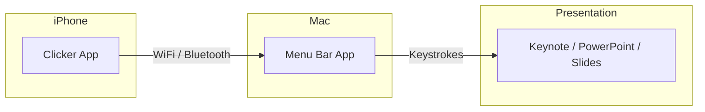

# Clicker

**Control your presentations from your iPhone — no dongles, no internet required.**

Clicker is a presentation remote that turns your iPhone into a wireless clicker for your Mac. It uses peer-to-peer networking via Apple's MultipeerConnectivity framework — no cloud servers, no account required, works completely offline.

## Features

| Feature | Description |
|---------|-------------|
| **Wireless Control** | Navigate slides with large, easy-to-hit touch targets |
| **Peer-to-Peer** | Direct connection via MultipeerConnectivity (WiFi or Bluetooth) |
| **Presentation Timer** | Track time with configurable haptic alerts |
| **Works Offline** | No internet connection needed |
| **Dark Mode** | Stage-friendly interface with liquid glass aesthetic |
| **Universal** | Works with any app that uses arrow keys |

## Apps

### Mac App (Free & Open Source)

The Mac app runs in your menu bar and receives commands from the iPhone app. It injects keystrokes into the frontmost application using macOS Accessibility APIs.

[Download from GitHub :material-github:](https://github.com/douinc/clicker/releases){ .md-button .md-button--primary }
[Build from Source](development/building.md){ .md-button }

### iPhone App

The iPhone app provides the remote control interface with large navigation buttons and a presentation timer with haptic feedback.

[App Store — Coming Soon :material-apple:](#){ .md-button disabled style="pointer-events:none;opacity:0.5" }

!!! info "Subscription"
    The iPhone app includes a 7-day free trial, then $4.99/year.

## Quick Start

1. **Install the Mac app** — Download from releases or build from source
2. **Grant Accessibility permission** — Required for keystroke injection
3. **Install the iPhone app** — Download from App Store
4. **Connect** — Both devices on the same network, tap to connect
5. **Present!** — Use the large buttons to control your slides

## Compatibility

Works with any presentation software that uses arrow keys:

- Apple Keynote
- Microsoft PowerPoint
- Google Slides
- Figma
- Canva
- PDF viewers
- And more...

## Privacy

Clicker respects your privacy:

- **No accounts** — No sign-up required
- **No cloud** — All communication is peer-to-peer
- **No analytics** — We don't track your usage
- **No data collection** — Your presentations stay on your devices

## License

This project is licensed under the MIT License. See the [LICENSE](https://github.com/douinc/clicker/blob/main/LICENSE) file for details.
