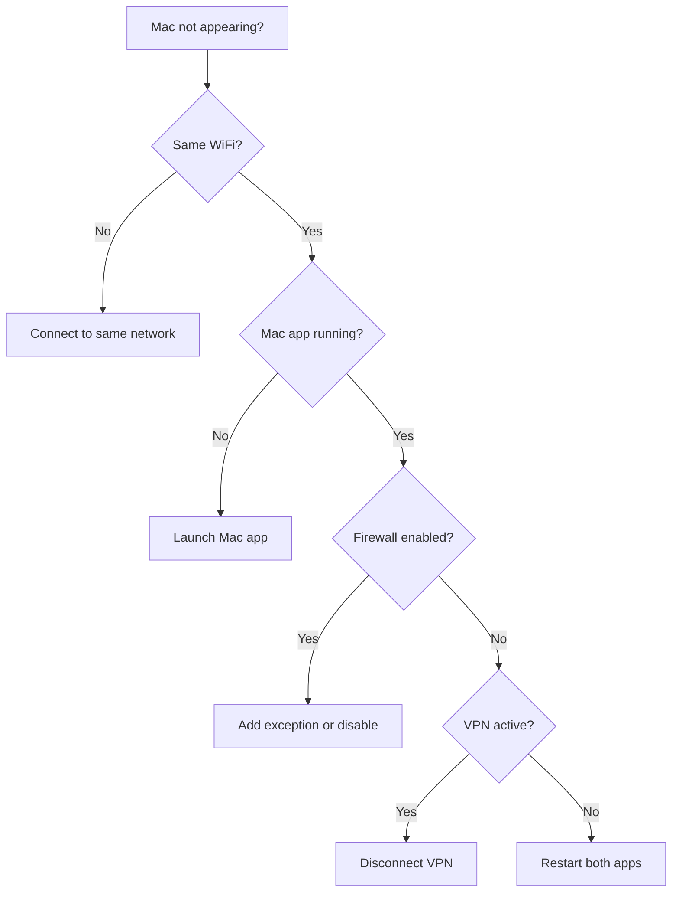

# Troubleshooting

## Connection Issues

### Mac not appearing in iPhone app

**Symptoms**: iPhone shows "Searching..." but no Macs appear.

**Solutions**:

1. **Check network**: Both devices must be on the same WiFi network
2. **Check Mac app**: Ensure it's running (look for menu bar icon)
3. **Firewall**: Temporarily disable macOS firewall to test
4. **VPN**: Disconnect any VPN — they often block local traffic
5. **Restart discovery**: Kill and restart both apps



### Connection drops frequently

**Solutions**:

1. **WiFi stability**: Move closer to router
2. **Bluetooth fallback**: MultipeerConnectivity will use Bluetooth if WiFi fails
3. **Sleep settings**: Prevent Mac from sleeping during presentation
4. **Power**: Keep iPhone charged or plugged in

### "Local Network" permission denied

On iPhone:

1. Go to **Settings → Privacy & Security → Local Network**
2. Find **Clicker** in the list
3. Enable the toggle

If Clicker isn't listed, delete and reinstall the app.

---

## Keystroke Issues

### Keystrokes not working

**Symptoms**: iPhone shows "Connected" but slides don't change.

**Solutions**:

1. **Accessibility permission**: Check System Settings → Privacy & Security → Accessibility
2. **Correct app focused**: The presentation app must be frontmost
3. **Presentation mode**: Some apps only respond to keys in presentation mode

### Wrong app receiving keystrokes

`CGEvent` sends keystrokes to the frontmost application. Ensure:

1. Your presentation app is in front
2. No dialogs or other windows are covering it
3. Menu bar isn't selected

### Accessibility permission not sticking

If permission resets after restart:

1. Remove Clicker from the Accessibility list
2. Delete the app
3. Reinstall and grant permission again

This can happen if the app was moved or the code signature changed.

---

## Build Issues

### "Signing requires a development team"

Add your Team ID to `project.yml`:

```yaml
settings:
  base:
    DEVELOPMENT_TEAM: YOUR_TEAM_ID
```

Find your Team ID:

```bash
security find-identity -v -p codesigning | grep "Apple Development"
```

Then regenerate:

```bash
xcodegen generate
```

### "Unable to find destination"

List available destinations:

```bash
xcodebuild -scheme ClickeriOS -showdestinations
```

Use an exact match from the output:

```bash
xcodebuild -scheme ClickeriOS \
  -destination 'platform=iOS Simulator,name=iPhone 16,OS=18.2' \
  build
```

### "No such module" errors

Clean and rebuild:

```bash
rm -rf ~/Library/Developer/Xcode/DerivedData/Clicker-*
xcodegen generate
xcodebuild -scheme ClickeriOS build
```

### MultipeerConnectivity compile errors

Ensure `project.yml` has the required Info.plist entries:

```yaml
targets:
  ClickeriOS:
    info:
      properties:
        NSBonjourServices:
          - _clicker._tcp
          - _clicker._udp
        NSLocalNetworkUsageDescription: "..."
```

---

## Subscription Issues

### Trial not starting

The trial starts on first launch. If it doesn't:

1. Check device date/time is correct
2. Keychain access might be restricted
3. Try deleting and reinstalling the app

!!! note "Trial Survives Reinstall"
    The trial start date is stored in Keychain, which persists across app reinstalls.

### Purchase not completing

1. Check internet connection
2. Ensure Apple ID is signed in
3. Try "Restore Purchases" if you've purchased before
4. Check for pending App Store updates

### Subscription status not updating

Force refresh:

1. Kill the app completely
2. Wait 30 seconds
3. Relaunch

StoreKit caches entitlements; a fresh launch forces a check.

---

## Timer Issues

### Haptics not working

1. **Silent mode**: Haptics work even in silent mode, but check iOS settings
2. **Do Not Disturb**: May suppress some feedback
3. **Test button**: Use Settings → Test Haptic to verify

### Timer inaccurate during background

iOS may throttle background timers. For best accuracy:

1. Keep app in foreground
2. Disable auto-lock during presentations
3. Keep screen on (use Guided Access if needed)

---

## General

### App crashes on launch

1. Delete and reinstall
2. Check iOS/macOS version meets minimum requirements
3. Report the crash: Settings → Privacy → Analytics → Analytics Data

### Battery drain

MultipeerConnectivity uses WiFi and Bluetooth. To minimize drain:

1. Connect only when presenting
2. Disconnect when done
3. Keep iPhone charged during long presentations

---

## Getting Help

If you're still stuck:

1. Check [GitHub Issues](https://github.com/douinc/clicker/issues) for similar problems
2. Open a new issue with:
   - Device models and OS versions
   - Steps to reproduce
   - Any error messages
3. Include logs if possible
