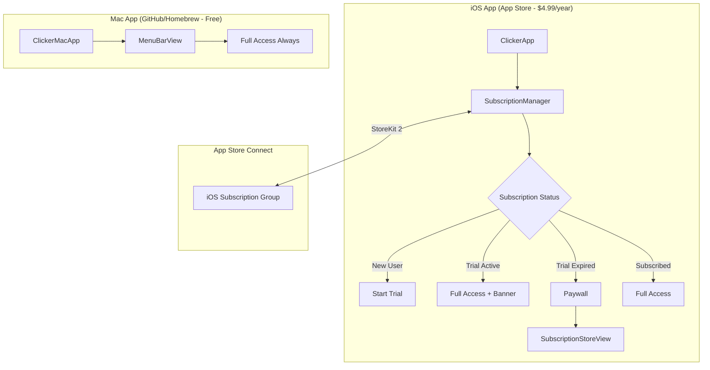
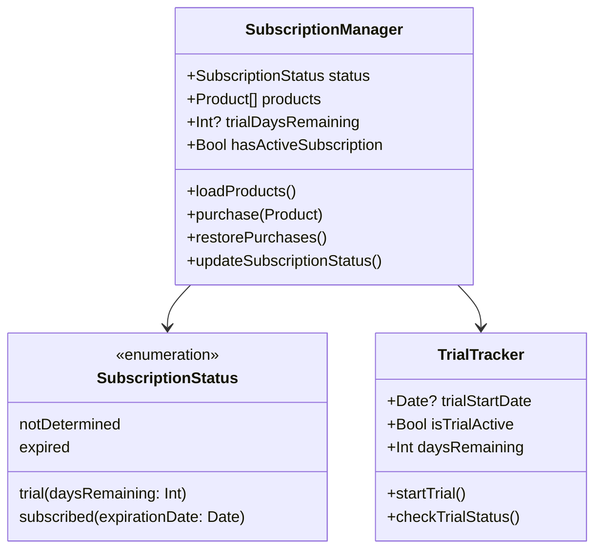
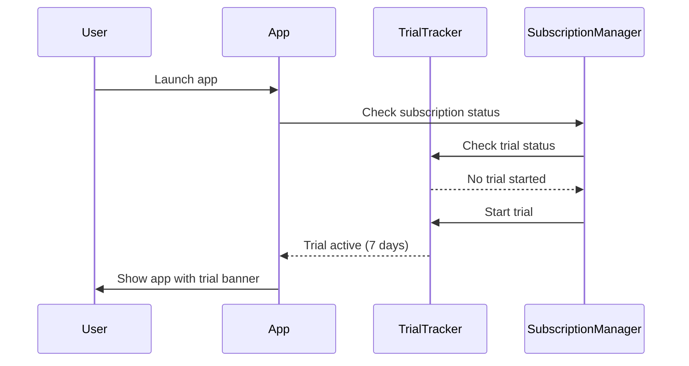
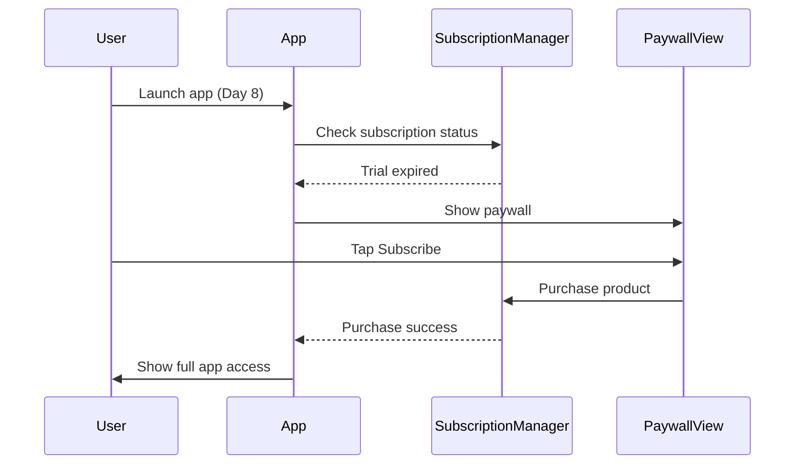
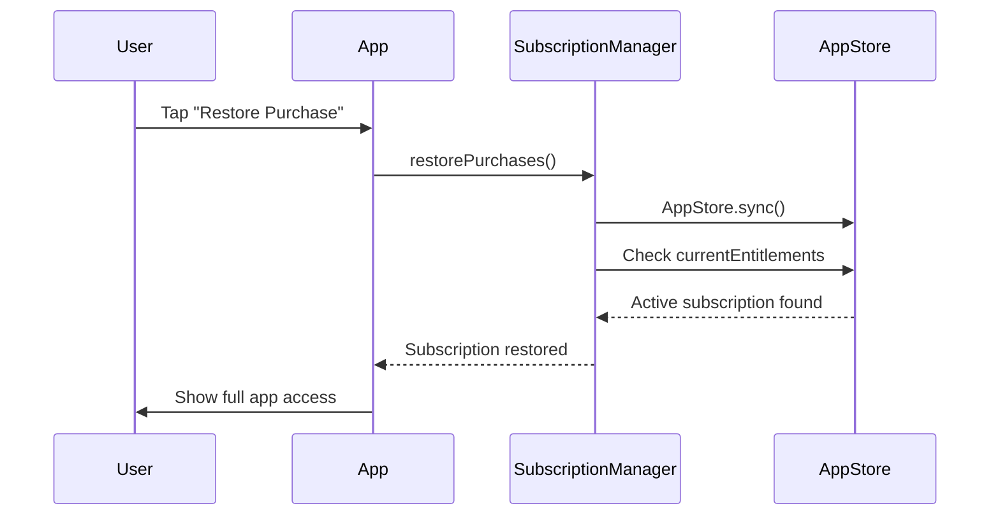

# feat: Add Subscription Model with 7-Day Trial ($4.99/year)

## Overview

Monetize the Clicker presentation remote with a **iOS-only subscription** while keeping the Mac app **free and open-source**:
- **iOS App (App Store)**: $4.99/year subscription with 7-day free trial
- **Mac App (GitHub/Homebrew)**: Free, open-source distribution

## Problem Statement / Motivation

The Clicker app provides valuable functionality (presentation remote control, timer with haptics) but currently has no revenue model. This hybrid monetization strategy will:
1. Generate recurring revenue from the iOS app (the active controller users interact with)
2. Remove friction for Mac app adoption (the passive receiver component)
3. Build community trust through open-source Mac distribution
4. Simplify App Store Connect management (single subscription)

## Architecture Decision: iOS-Only Subscription + Open-Source Mac

**Strategy**: Monetize the mobile controller, distribute the desktop receiver for free.

- iOS: `com.dou.clicker-ios.subscription.yearly` — Paid subscription
- Mac: Free via GitHub releases and Homebrew

**Rationale**:
- The iPhone app is the "product" users actively engage with during presentations
- The Mac app is infrastructure—making it free removes adoption friction
- Open-source builds trust and enables community contributions
- Homebrew distribution is familiar to developers (target audience)



## Technical Approach

### Implementation Architecture



### Files to Create (iOS Only)

| File | Purpose |
|------|---------|
| `iPhoneApp/SubscriptionManager.swift` | StoreKit 2 subscription handling |
| `iPhoneApp/TrialTracker.swift` | Trial period tracking with Keychain storage |
| `iPhoneApp/SubscriptionStatus.swift` | Subscription state enum |
| `iPhoneApp/PaywallView.swift` | iOS paywall using SubscriptionStoreView |
| `Products.storekit` | StoreKit testing configuration |

### Files to Modify

| File | Modification |
|------|-------------|
| `project.yml` | Add StoreKit capability, In-App Purchase entitlement (iOS target only) |
| `iPhoneApp/PresentationRemoteiPhoneApp.swift` | Add SubscriptionManager, paywall gate |

### Mac App Distribution Files to Create

| File | Purpose |
|------|---------|
| `.github/workflows/release.yml` | GitHub Actions workflow for building and releasing Mac app |
| `Formula/clicker.rb` | Homebrew formula for tap distribution |
| `Makefile` | Build commands for local development and CI |

## Implementation Phases

### Phase 1: iOS Subscription Foundation
**Goal**: Set up StoreKit infrastructure for iOS app

1. Create `iPhoneApp/SubscriptionStatus.swift`
   ```swift
   enum SubscriptionStatus: Equatable {
       case notDetermined
       case trial(daysRemaining: Int)
       case subscribed(expirationDate: Date)
       case expired
   }
   ```

2. Create `iPhoneApp/TrialTracker.swift`
   - Store trial start date in Keychain (survives app deletion)
   - Calculate days remaining
   - 7-day trial duration constant

3. Create `iPhoneApp/SubscriptionManager.swift`
   - `@MainActor @Observable` class
   - Transaction.updates listener
   - Transaction.currentEntitlements checking
   - Product loading and caching
   - Purchase flow handling

4. Update `project.yml` (iOS target only):
   ```yaml
   ClickeriOS:
     capabilities:
       In-App Purchase: {}
   ```

### Phase 2: iOS Paywall Integration
**Goal**: Implement subscription flow and UI for iOS app

1. Create `iPhoneApp/PaywallView.swift`
   - Use `SubscriptionStoreView` (iOS 17+)
   - Show trial benefits
   - Include restore purchase button
   - Add legal disclosures

2. Modify `iPhoneApp/PresentationRemoteiPhoneApp.swift`
   - Inject SubscriptionManager as @StateObject
   - Add subscription check gate before RemoteControlView
   - Show trial banner when in trial mode

3. Add subscription status display in settings

### Phase 3: Mac App Distribution Setup
**Goal**: Set up free distribution via GitHub and Homebrew

1. Create `.github/workflows/release.yml`
   - Build signed Mac app on push to tag
   - Create GitHub release with DMG artifact
   - Notarize app for Gatekeeper compliance

2. Create `Formula/clicker.rb` (Homebrew tap)
   ```ruby
   class Clicker < Cask
     version "1.0.0"
     sha256 "..."
     url "https://github.com/douinc/presentation-remote/releases/download/v#{version}/Clicker.dmg"
     name "Clicker"
     desc "Presentation remote control - Mac receiver app"
     homepage "https://github.com/douinc/presentation-remote"
     app "Clicker.app"
   end
   ```

3. Update README with installation instructions:
   - `brew install --cask douinc/tap/clicker`
   - Direct DMG download from GitHub releases

### Phase 4: Testing Configuration
**Goal**: Set up testing infrastructure

1. Create `Products.storekit`:
   ```json
   {
     "subscriptionGroups": [{
       "id": "premium_group",
       "subscriptions": [{
         "productID": "com.dou.clicker_ios.subscription.yearly",
         "displayPrice": "4.99",
         "introductoryOffer": {
           "paymentMode": "freeTrial",
           "subscriptionPeriod": "P1W"
         }
       }]
     }]
   }
   ```

2. Add StoreKit configuration to Xcode scheme
3. Test all subscription states

### Phase 5: App Store Connect Setup (iOS Only)
**Goal**: Configure real products for iOS app submission

1. Create subscription group in App Store Connect
2. Add yearly subscription product
3. Configure 7-day free trial introductory offer
4. Set $4.99/year pricing for all territories
5. Add subscription localizations

## Acceptance Criteria

### iOS App Functional Requirements
- [x] New users automatically start 7-day trial on first launch
- [x] Trial status shows days remaining (e.g., "Trial: 5 days left")
- [x] Paywall appears when trial expires
- [x] Users can purchase $4.99/year subscription
- [x] Subscription unlocks full app functionality
- [x] Restore purchase works for existing subscribers
- [x] Subscription renews automatically each year
- [x] Works offline with 7-day cached entitlement

### Mac App Distribution Requirements
- [x] GitHub Actions builds and signs Mac app on tag push
- [x] DMG artifact uploaded to GitHub releases
- [x] App notarized for Gatekeeper compliance
- [x] Homebrew cask formula installable via `brew install --cask`
- [ ] README includes installation instructions

### Non-Functional Requirements
- [x] Purchase flow completes in <3 seconds on good network
- [x] Subscription status cached for offline use (7 days)
- [x] Trial tracking persists through app deletion (Keychain)

### Quality Gates
- [x] All subscription states tested via StoreKit config
- [ ] iOS paywall tested on device and simulator
- [ ] Mac app installs correctly from GitHub release
- [ ] Sandbox purchase flow verified
- [ ] App Store Guidelines compliance verified (3.1.2)

## User Flows

### Flow 1: First-Time User


### Flow 2: Trial Expiration


### Flow 3: Restore Purchase


## MVP Code Snippets

### SubscriptionManager.swift (iOS)

```swift
import StoreKit
import Foundation

@MainActor
@Observable
final class SubscriptionManager {
    private(set) var products: [Product] = []
    private(set) var status: SubscriptionStatus = .notDetermined

    private var transactionListener: Task<Void, Never>?
    private let trialTracker = TrialTracker()
    private let productID: String

    init(productID: String) {
        self.productID = productID
        transactionListener = listenForTransactions()

        Task {
            await loadProducts()
            await updateSubscriptionStatus()
        }
    }

    deinit {
        transactionListener?.cancel()
    }

    var hasAccess: Bool {
        switch status {
        case .trial, .subscribed:
            return true
        case .notDetermined, .expired:
            return false
        }
    }

    func loadProducts() async {
        do {
            products = try await Product.products(for: [productID])
        } catch {
            print("Failed to load products: \(error)")
        }
    }

    func purchase(_ product: Product) async throws -> Bool {
        let result = try await product.purchase()

        switch result {
        case .success(let verification):
            if case .verified(let transaction) = verification {
                await updateSubscriptionStatus()
                await transaction.finish()
                return true
            }
        case .userCancelled, .pending:
            break
        @unknown default:
            break
        }
        return false
    }

    func restorePurchases() async {
        try? await AppStore.sync()
        await updateSubscriptionStatus()
    }

    func updateSubscriptionStatus() async {
        // Check for active subscription first
        for await result in Transaction.currentEntitlements {
            if case .verified(let transaction) = result,
               transaction.productType == .autoRenewable,
               let expirationDate = transaction.expirationDate,
               expirationDate > Date() {
                status = .subscribed(expirationDate: expirationDate)
                return
            }
        }

        // No active subscription, check trial
        if trialTracker.isTrialActive {
            status = .trial(daysRemaining: trialTracker.daysRemaining)
        } else if !trialTracker.hasTrialStarted {
            // First launch - start trial
            trialTracker.startTrial()
            status = .trial(daysRemaining: 7)
        } else {
            status = .expired
        }
    }

    private func listenForTransactions() -> Task<Void, Never> {
        Task.detached { [weak self] in
            for await result in Transaction.updates {
                if case .verified(let transaction) = result {
                    await self?.updateSubscriptionStatus()
                    await transaction.finish()
                }
            }
        }
    }
}
```

### TrialTracker.swift (iOS)

```swift
import Foundation
import Security

final class TrialTracker {
    private let trialDuration: TimeInterval = 7 * 24 * 60 * 60 // 7 days
    private let keychainKey = "com.dou.clicker.trialStartDate"

    var trialStartDate: Date? {
        get { readFromKeychain() }
        set { saveToKeychain(newValue) }
    }

    var hasTrialStarted: Bool {
        trialStartDate != nil
    }

    var isTrialActive: Bool {
        guard let startDate = trialStartDate else { return false }
        return Date() < startDate.addingTimeInterval(trialDuration)
    }

    var daysRemaining: Int {
        guard let startDate = trialStartDate else { return 0 }
        let expirationDate = startDate.addingTimeInterval(trialDuration)
        let remaining = Calendar.current.dateComponents([.day], from: Date(), to: expirationDate).day ?? 0
        return max(0, remaining)
    }

    func startTrial() {
        if trialStartDate == nil {
            trialStartDate = Date()
        }
    }

    // MARK: - Keychain Storage

    private func saveToKeychain(_ date: Date?) {
        // Delete existing item
        let deleteQuery: [String: Any] = [
            kSecClass as String: kSecClassGenericPassword,
            kSecAttrAccount as String: keychainKey
        ]
        SecItemDelete(deleteQuery as CFDictionary)

        // Save new date if provided
        guard let date = date else { return }
        let data = "\(date.timeIntervalSince1970)".data(using: .utf8)!

        let addQuery: [String: Any] = [
            kSecClass as String: kSecClassGenericPassword,
            kSecAttrAccount as String: keychainKey,
            kSecValueData as String: data,
            kSecAttrAccessible as String: kSecAttrAccessibleAfterFirstUnlock
        ]
        SecItemAdd(addQuery as CFDictionary, nil)
    }

    private func readFromKeychain() -> Date? {
        let query: [String: Any] = [
            kSecClass as String: kSecClassGenericPassword,
            kSecAttrAccount as String: keychainKey,
            kSecReturnData as String: true
        ]

        var result: AnyObject?
        guard SecItemCopyMatching(query as CFDictionary, &result) == errSecSuccess,
              let data = result as? Data,
              let string = String(data: data, encoding: .utf8),
              let timestamp = Double(string) else {
            return nil
        }

        return Date(timeIntervalSince1970: timestamp)
    }
}
```

### PaywallView.swift (iOS)

```swift
import SwiftUI
import StoreKit

struct PaywallView: View {
    @Environment(SubscriptionManager.self) private var subscriptionManager
    @Environment(\.dismiss) private var dismiss

    var body: some View {
        SubscriptionStoreView(groupID: "premium_group") {
            VStack(spacing: 16) {
                Image(systemName: "hand.tap.fill")
                    .font(.system(size: 60))
                    .foregroundStyle(.blue)

                Text("Clicker Premium")
                    .font(.largeTitle.bold())

                Text("Control your presentations with ease")
                    .foregroundStyle(.secondary)

                VStack(alignment: .leading, spacing: 12) {
                    FeatureRow(text: "Wireless slide control")
                    FeatureRow(text: "Presentation timer with haptics")
                    FeatureRow(text: "One-tap connection")
                }
                .padding(.top)
            }
            .padding()
        }
        .subscriptionStoreControlStyle(.prominentPicker)
        .subscriptionStoreButtonLabel(.multiline)
        .storeButton(.visible, for: .restorePurchases)
        .onInAppPurchaseCompletion { _, result in
            if case .success = result {
                dismiss()
            }
        }
    }
}

struct FeatureRow: View {
    let text: String

    var body: some View {
        HStack(spacing: 12) {
            Image(systemName: "checkmark.circle.fill")
                .foregroundStyle(.green)
            Text(text)
        }
    }
}
```

## Success Metrics

### iOS Subscription Metrics

| Metric | Target |
|--------|--------|
| Trial-to-paid conversion | >10% |
| Day 7 paywall display rate | >90% of trial users |
| Restore success rate | >95% |
| Purchase error rate | <5% |

### Mac Distribution Metrics

| Metric | Target |
|--------|--------|
| GitHub release download count | Track monthly |
| Homebrew install count | Track via brew analytics |
| GitHub stars | Community interest indicator |

## Dependencies & Prerequisites

1. **Apple Developer Account**: Paid Applications agreement signed
2. **App Store Connect**: Banking/tax info configured (iOS only)
3. **Legal Documents**: Terms of Service and Privacy Policy URLs
4. **Bundle IDs**: Already configured (`com.dou.clicker-ios`, `com.dou.clicker-mac`)
5. **Development Team**: HD35YQ72U4 (configured in project.yml)
6. **GitHub Repository**: Public repo for open-source Mac app
7. **Apple Notarization**: Developer ID certificate for Mac app signing

## Risk Analysis & Mitigation

| Risk | Probability | Impact | Mitigation |
|------|-------------|--------|------------|
| App Store rejection (iOS) | Medium | High | Follow Guidelines 3.1.2 strictly, include all required disclosures |
| Trial bypass via reinstall | Low | Medium | Keychain storage survives app deletion |
| Offline access abuse | Low | Low | 7-day cache acceptable tradeoff for UX |
| StoreKit API changes | Low | Medium | Using stable StoreKit 2 APIs |
| Gatekeeper blocks Mac app | Medium | Medium | Proper notarization and code signing |
| Homebrew formula maintenance | Low | Low | Automate formula updates via GitHub Actions |

## Documentation Plan

- [ ] Update CLAUDE.md with subscription testing instructions
- [ ] Add troubleshooting section for common subscription issues
- [ ] Document App Store Connect configuration steps
- [ ] Update README with Mac installation instructions (Homebrew + direct download)
- [ ] Add CONTRIBUTING.md for open-source contributions

## References

### Internal References
- Project configuration: `project.yml:1-101`
- iOS app entry: `iPhoneApp/PresentationRemoteiPhoneApp.swift:5-14`
- Mac app entry: `MacApp/PresentationRemoteMacApp.swift:1-146`
- Shared commands: `Shared/RemoteCommand.swift:1-28`

### External References

**iOS Subscription:**
- [StoreKit 2 Documentation](https://developer.apple.com/storekit/)
- [Auto-renewable Subscriptions](https://developer.apple.com/app-store/subscriptions/)
- [App Review Guidelines 3.1.2](https://developer.apple.com/app-store/review/guidelines/#in-app-purchase)
- [Setting up introductory offers](https://developer.apple.com/help/app-store-connect/manage-subscriptions/set-up-introductory-offers-for-auto-renewable-subscriptions/)
- [WWDC23: What's new in StoreKit 2](https://developer.apple.com/videos/play/wwdc2023/10140/)

**Mac Distribution:**
- [Notarizing macOS Software](https://developer.apple.com/documentation/security/notarizing_macos_software_before_distribution)
- [Creating a DMG Installer](https://developer.apple.com/forums/thread/128166)
- [GitHub Actions for macOS](https://docs.github.com/en/actions/using-github-hosted-runners/about-github-hosted-runners#supported-runners-and-hardware-resources)
- [Homebrew Cask Cookbook](https://docs.brew.sh/Cask-Cookbook)
- [Creating a Homebrew Tap](https://docs.brew.sh/How-to-Create-and-Maintain-a-Tap)
