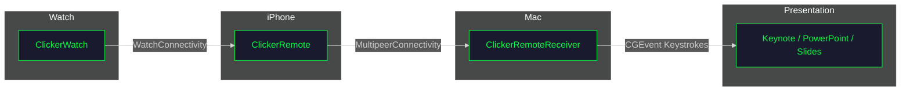

# ClickerRemote Developer Wiki

Welcome to the ClickerRemote developer documentation. This wiki contains technical documentation for developers who want to build, modify, or contribute to the project.

## Quick Links

| Section | Description |
|---------|-------------|
| [[Getting-Started]] | Set up your development environment |
| [[Architecture]] | System design and component overview |
| [[Building]] | Build commands and distribution |
| [[API-Reference]] | Code structure and key classes |
| [[Contributing]] | How to contribute |
| [[Troubleshooting]] | Common issues and solutions |

## Project Overview

ClickerRemote is a presentation remote system consisting of three apps:

- **ClickerRemote** (iOS v1.7) — Remote control app for iPhone
- **ClickerRemoteReceiver** (macOS v1.2) — Menu bar app that receives commands
- **ClickerWatch** (watchOS v1.7) — Apple Watch companion for wrist-based control



## Tech Stack

| Component | Technology |
|-----------|------------|
| Language | Swift 5.9 |
| UI Framework | SwiftUI |
| Networking | MultipeerConnectivity, WatchConnectivity |
| Build System | XcodeGen + xcodebuild |
| macOS Target | 14.0+ (Sonoma) |
| iOS Target | 18.0+ |
| watchOS Target | 10.0+ |

## Repository Structure

```
clicker/
├── project.yml          # XcodeGen configuration
├── justfile             # Build automation
├── Shared/              # Shared code between apps
│   └── RemoteCommand.swift
├── MacApp/              # macOS menu bar app
├── iPhoneApp/           # iOS remote control app
├── WatchApp/            # watchOS companion app
├── wiki/                # GitHub Wiki source
├── public/              # Logos and screenshots
├── build/               # Build artifacts
└── .github/             # GitHub Actions workflows
```

## Distribution

| App | Distribution | Link |
|-----|--------------|------|
| ClickerRemoteReceiver | GitHub Releases (DMG) | [Releases](https://github.com/douinc/clicker/releases) |
| ClickerRemoteReceiver | Homebrew Cask | `brew tap douinc/tap && brew install --cask clicker-remote-receiver` |
| ClickerRemote | App Store | [App Store](https://apps.apple.com/us/app/clickerremote/id6758130180) |
| ClickerWatch | Bundled with iOS app | Installs automatically via Watch app |

## License

MIT License — see [LICENSE](https://github.com/douinc/clicker/blob/main/LICENSE)

---

*Maintained by [DOU Inc.](https://github.com/douinc)*
